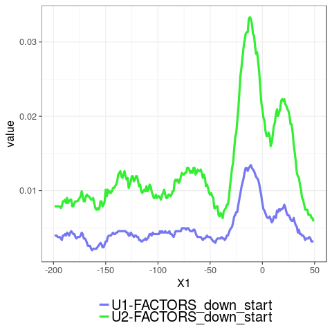
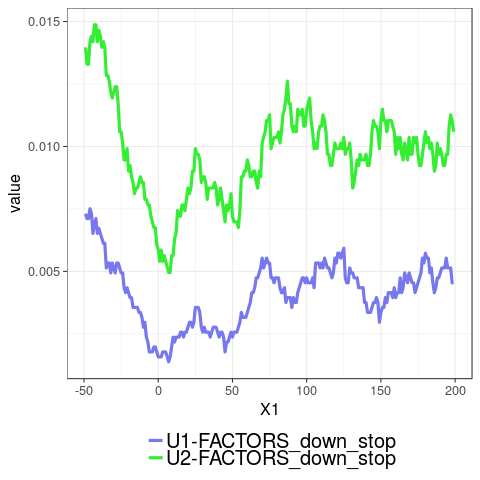

metaexon_coverage script documentation
======================================

.. _bedtools: https://bedtools.readthedocs.io/en/latest/content/installation.html
.. _bedGraphToBigWig: http://hgdownload.soe.ucsc.edu/admin/exe/

Description
===========

This script aims to create the figures of CLIP density in the article of *Lemaire et al* entitled :
**Splicing factors and chromatin organization enhance exon recognition by alleviating constraints generated by gene nucleotide composition bias**

This script take as input:
  1. A **bed file** or a **folder containing bed files**. (argument ``--input``)
  2. A file containing the size of *hg19 chromosome*. (argument ``--refsize``)
  3. A wanted annotation that corresponds to **GC-AT** or the name of a (splicesome-) **factor**. (argument ``--annotation``)
  4. The path to the script that will build the figures created by **Sébatien Lemaire**. (argument ``--metagene_script``)

Those 4 inputs are required to create the CLIP peaks figures. The ``metaexon_coverage`` program works as follow:
The bed input file(s) are transformed into bigwig file thanks to the bedtools_ [QuHa10]_ and the bedGraphToBigWig_ [KZB10]_ program.
This script also uses the annotation selected with the argument **annotation** to recover all exons that coresponds to it (GC-AT activated exons or spliceosome activated exons).
It then create two "annotation bed files" corresponding to exon-intron junctions sequences of those exons containing the 3'SS or 5'SS respectively (the junctions sequences corresponds to 100 nucleotides within the intron and 50 nucleotides within the exons).
Finaly the signal of every bigwig files is reported only for the junctions containing the 5'SS and the 3'SS in "annotation bed files" and averaged to displayed the signal in two figures : one representing the signal on the 3'SS junctions and the other on 5'SS junctions.

.. note::

  The figures described below are found in a new created directory named ``metagene_mean``. Other figures are also created but not described here.

It will create figures like this :

  **Clip signal of U2AF2 on GC and AT-exons on 3'SS junction**

  **Clip signal of U2AF2 on GC and AT-exons on 5'SS junction**

.. note::

  Those figures were created using the bed file downloaded on `POSTAR2 <http://lulab.life.tsinghua.edu.cn/postar/>`_ for the project identifed by ``GSE83923`` and ``GSM2221657``.

Prerequisites
-------------

This program uses ``python 3.5`` with the following modules :
  * subprocess
  * os
  * argparse
  * sqlite3
  * gzip
  * re

It was written in Ubuntu 16.04 environment and shoud work on unix system with a bash shell.

  1. You may have to install python 3, if you do click `here <https://www.python.org/downloads/release/python-356/>`_
  2. You have to install argparse v1.1 as it the only one not contained in default library in python3. You can use the following command : ``pip3 install argparse==1.1``.
  3. You also need to install the bedtools_ and the bedGraphToBigWig_ program. They must be available in you PATH.
  4. The folder `data/` (inside ``Clip_analysis/``) must contains the ``fasterDB_lite.bd`` and the ``sed.db`` files. The creation of those database is explained inside  ``Database_creator`` folder.

Execution of the program
------------------------

To display some help:

.. code::

  python3 src/metaexon_coverage.py --help

Commands executed:

.. code::

  python3 src/metaexon_coverage.py --output result/coverage_with_U1-U2_factors/ --input data/coverage_project_selected/ --refsize data/hg19.ren.chrom.sizes --metagene_script /media/nicolas/DD_1/Splicing_Lore_project/FarLine_exons_results_summary/src/skipped_exon_list_results_summary/coverage_summary/metagene_coverage.r  --annotation U1-FACTORS,U2-FACTORS
  python3 src/metaexon_coverage.py --output result/coverage_with_GC-AT_factors/ --input data/coverage_project_selected/ --refsize data/hg19.ren.chrom.sizes --metagene_script /media/nicolas/DD_1/Splicing_Lore_project/FarLine_exons_results_summary/src/skipped_exon_list_results_summary/coverage_summary/metagene_coverage.r  --annotation GC-AT

.. rubric:: References

.. [QuHa10] Quinlan, A. R. & Hall, I. M. BEDTools: a flexible suite of utilities for comparing genomic features. Bioinformatics 26, 841–842 (2010).
.. [KZB10] Kent WJ, Zweig AS, Barber G, Hinrichs AS, Karolchik D. BigWig and BigBed: enabling browsing of large distributed data sets. Bioinformatics. 2010 Sep 1;26(17):2204-7.
