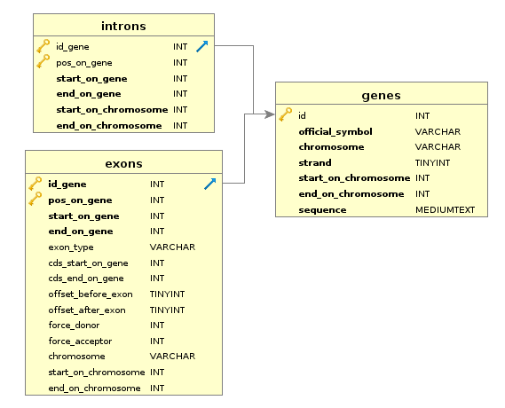

FasterDB Lite Creation's documentation
======================================

Description
-----------

This program contains the following scripts:
	* ``database_creator.py`` :  This script aims to create the **empty tables** of the *FasterDB-Lite* database
	* ``database_filler.py`` : this script will launch ``database_creator.py`` and fill the table created by it.

At the end the **FasterDB Lite** database created have the following relational schema :

	**Relational schema of the FasterDB Lite database**

.. note::

	This new database will next be used by many programs.

Prerequisite
------------

This program uses `python <https://www.python.org>`_ version ``3.5`` and this following dependencies:
  * `os <https://docs.python.org/3.5/library/os.html>`_ : to test whether a file or a dir exist and to create dir
  * `sqlite3 v2.6.0 <https://docs.python.org/3.5/library/sqlite3.html>`_ : To create *FasterDB Lite* database
  * `pymysql v0.8.0 <http://pymysql.readthedocs.io/en/latest/user/examples.html>`_ : To connect to the real *FasterDB* database

Exectuted commands to create the *FasterDB_Lite* database
---------------------------------------------------------

.. code-block:: bash

	python3 src/database_filler.py
