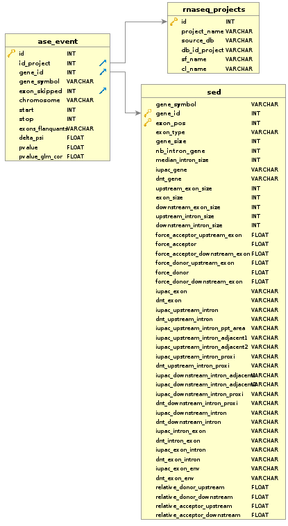

SedDB Creation's documentation
==============================

Description
-----------

This program contains the following scripts:
  * ``exon_class.py`` : This script aims to calculates lots of information for every exons from **FasterDB-Lite database**
  * ``database_filler.py``: This script will create and empty **Sed database** and then fill it thanks to ``exon_class.py``

At the end the **Sed (Simple Exons description) database** created have the following relational schema :

  **Relational schema of the Sed database**

Here is described every field in the table sed:

+-------------------------------------+----------------------------------------------------------------------------------------------------------------------------------------------------------------------+
|            Field                    |                                                                           Description                                                                                |
+-------------------------------------+----------------------------------------------------------------------------------------------------------------------------------------------------------------------+
|           gene_symbol               | HGNC symbol of the gene                                                                                                                                              |
+-------------------------------------+----------------------------------------------------------------------------------------------------------------------------------------------------------------------+
|           gene_id                   | FasterDB identifiant of a gene                                                                                                                                       |
+-------------------------------------+----------------------------------------------------------------------------------------------------------------------------------------------------------------------+
|           exon_pos                  | Position of the exon within the gene (given in FasterDB)                                                                                                             |
+-------------------------------------+----------------------------------------------------------------------------------------------------------------------------------------------------------------------+
|           exon_type                 | The type the exon, it can be CCE (Constitutive Coding Exon), ACE (Alternative Coding Exon), FCE (First Coding Exon), LCE (Last Coding Exon)                          |
+-------------------------------------+----------------------------------------------------------------------------------------------------------------------------------------------------------------------+
+          gene_size                  | The size (in nucleotide) of the gene that contains the exons                                                                                                         |
+-------------------------------------+----------------------------------------------------------------------------------------------------------------------------------------------------------------------+
|          nb_intron_gene             |  The number of intron within the gene                                                                                                                                |
+-------------------------------------+----------------------------------------------------------------------------------------------------------------------------------------------------------------------+
|          median_intron_size         | The median of the size of every intron in the gene that contains the exon of interest                                                                                |
+-------------------------------------+----------------------------------------------------------------------------------------------------------------------------------------------------------------------+
|          iupac_gene                 | The frequency (%) of nucleotides A, C, G, T, S, W, R, Y, K, M respectively within the gene that contains the exon of interest                                        |
+-------------------------------------+----------------------------------------------------------------------------------------------------------------------------------------------------------------------+
|     upstream_exon_size              | The nucleotide size of the upstream exon from the one of interest                                                                                                    |
+-------------------------------------+----------------------------------------------------------------------------------------------------------------------------------------------------------------------+
|         exon_size                   | The nucleotide size of the exon of interest                                                                                                                          |
+-------------------------------------+----------------------------------------------------------------------------------------------------------------------------------------------------------------------+
|       downstream_exon_size          | The nucleotide size of the downstream exon from the one of interest                                                                                                  |
+-------------------------------------+----------------------------------------------------------------------------------------------------------------------------------------------------------------------+
|  force_acceptor_upstream_exon       | The force of the splice acceptor site of the upstream exon                                                                                                           |
+-------------------------------------+----------------------------------------------------------------------------------------------------------------------------------------------------------------------+
|       force_acceptor                | The force of the splice acceptor site of the interest exon                                                                                                           |
+-------------------------------------+----------------------------------------------------------------------------------------------------------------------------------------------------------------------+
|  force_acceptor_downstream_exon     | The force of the splice acceptor site of the downstream exon                                                                                                         |
+-------------------------------------+----------------------------------------------------------------------------------------------------------------------------------------------------------------------+
|  force_donor_upstream_exon          | The force of the splice donor site of the upstream exon                                                                                                              |
+-------------------------------------+----------------------------------------------------------------------------------------------------------------------------------------------------------------------+
|       force_donor                   | The force of the splice donor site of the interest exon                                                                                                              |
+-------------------------------------+----------------------------------------------------------------------------------------------------------------------------------------------------------------------+
|  force_donor_downstream_exon        | The force of the splice donor site of the downstream exon                                                                                                            |
+-------------------------------------+----------------------------------------------------------------------------------------------------------------------------------------------------------------------+
|          iupac_exon                 | The frequency (%) of nucleotides A, C, G, T, S, W, R, Y, K, M respectively within the exon of interest                                                               |
+-------------------------------------+----------------------------------------------------------------------------------------------------------------------------------------------------------------------+
|  iupac_upstream_intron_dist         | The frequency (%) of nucleotides A, C, G, T, S, W, R, Y, K, M respectively within the region [-100,-26] of the upstream intron                                       |
+-------------------------------------+----------------------------------------------------------------------------------------------------------------------------------------------------------------------+
|  iupac_upstream_intron_proxi        | The frequency (%) of nucleotides A, C, G, T, S, W, R, Y, K, M respectively within the region [-25,-1] of the upstream intron (0 is the first nucleotide of the exon) |
+-------------------------------------+----------------------------------------------------------------------------------------------------------------------------------------------------------------------+
|  iupac_downstream_intron_proxi      | The frequency (%) of nucleotides A, C, G, T, S, W, R, Y, K, M respectively within the region [1,25] of the downstream intron (0 is the last nucleotide of the exon)  |
+-------------------------------------+----------------------------------------------------------------------------------------------------------------------------------------------------------------------+
|  iupac_upstream_intron_dist         | The frequency (%) of nucleotides A, C, G, T, S, W, R, Y, K, M respectively within the region [26;100] of the downstream intron                                       |
+-------------------------------------+----------------------------------------------------------------------------------------------------------------------------------------------------------------------+

.. note::

  This schema induce a lots of redundancy in the database. Indeed, we keep for each exon, data about its gene, so, for a gene we have the same data repeated as many times as the number of exons within the gene.
  The choice of keeping redundancy was made to improve the speed of programs that will use *Sed database*; Indeed, for one exon we have all the data we need. Despite this redundancy, the size of the database is reasonable (a little more than 100 Mo).

Prerequisite
------------

This program uses `python <https://www.python.org>`_ version ``3.5`` and this following dependencies:
  * `numpy v1.14.0 <https://docs.scipy.org/doc/numpy-1.14.0/user/quickstart.html>`_
  * `sqlite3 v2.6.0 <https://docs.python.org/3.5/library/sqlite3.html>`_ : To create *Sed* database
  * `sys v3.5.2 <https://docs.python.org/3.5/library/sys.html>`_

Exectuted commands to create the *Sed* database
---------------------------------------------------------

.. code-block:: bash

	python3 src/exon_information_retriever.py
