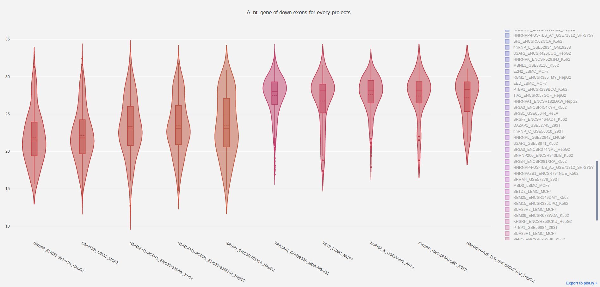

SL Projects Figure Creator's Documentation
==========================================

Description
------------

This script aims to create a lots of figures that shows, for each exons differentially spliced in a **rnaseq project** or by a **splicing factor**, their distribution for many caracteristics described in **SED database.**

.. note::

  **Reminder:** The rnaseq_project refers to every project analysed by FarRLine and stored in Splicing Lore database (the copied in SE database). Each project (rnaseq-data) shows exons that are up- or down-regulated in a cell line where a splicing factor is depleted (compared to a control condition in the same cell line when the splicing factor is persent).

.. note::

  The exon regulated by a splicing factor correponds to  every exons regulated by this splicing factor in at least one cell line and always \
  showing the same regulation if shown in multiple cell line. If a exon is seen multiple times with the same \
  regulation in different cell line, it is only displayed once.

After launching the script a lots of files should be created in the ``result/`` folder of the `Figure_ESA` directory.
They sould be named like this: **<prefix_name>_<regulation>_exons_figure.html**

**<regulation>** cant only take the following values :
  * **down** : if the figure show only **<prefix_name>** value for down-regulated exons in each rnaseq-project in splicing lore.
  * **up**: if the figure show only **<prefix_name>** value for up-regulated exons in each rnaseq-project in splicing lore.

**<prefix_name>** takes a lots of values that mean different things :

+-------------------------------------+----------------------------------------------------------------------------------------------------------------------------------------------------------------------+
|          **prefix**                 |                                               **values of <regulation>  exons displayed in the figure**                                                              |
+-------------------------------------+----------------------------------------------------------------------------------------------------------------------------------------------------------------------+
|          gene_size                  | The size (in nucleotide) of the gene that contains the exons                                                                                                         |
+-------------------------------------+----------------------------------------------------------------------------------------------------------------------------------------------------------------------+
|          nb_intron_gene             |  The number of intron within the gene                                                                                                                                |
+-------------------------------------+----------------------------------------------------------------------------------------------------------------------------------------------------------------------+
|          median_intron_size         | The median of the size of every intron in the gene that contains the exon of interest                                                                                |
+-------------------------------------+----------------------------------------------------------------------------------------------------------------------------------------------------------------------+
|          Xnt_gene                   | The frequency (%) of nucleotides X within the gene that contains the exon of interest. with X in A, C, G, T, S, W, R, Y, K, M                                        |
+-------------------------------------+----------------------------------------------------------------------------------------------------------------------------------------------------------------------+
|     upstream_exon_size              | The nucleotide size of the upstream exon from the one of interest                                                                                                    |
+-------------------------------------+----------------------------------------------------------------------------------------------------------------------------------------------------------------------+
|         exon_size                   | The nucleotide size of the exon of interest                                                                                                                          |
+-------------------------------------+----------------------------------------------------------------------------------------------------------------------------------------------------------------------+
|       downstream_exon_size          | The nucleotide size of the downstream exon from the one of interest                                                                                                  |
+-------------------------------------+----------------------------------------------------------------------------------------------------------------------------------------------------------------------+
|  force_acceptor_upstream_exon       | The force of the splice acceptor site of the upstream exon                                                                                                           |
+-------------------------------------+----------------------------------------------------------------------------------------------------------------------------------------------------------------------+
|       force_acceptor                | The force of the splice acceptor site of the interest exon                                                                                                           |
+-------------------------------------+----------------------------------------------------------------------------------------------------------------------------------------------------------------------+
|  force_acceptor_downstream_exon     | The force of the splice acceptor site of the downstream exon                                                                                                         |
+-------------------------------------+----------------------------------------------------------------------------------------------------------------------------------------------------------------------+
|  force_donor_upstream_exon          | The force of the splice donor site of the upstream exon                                                                                                              |
+-------------------------------------+----------------------------------------------------------------------------------------------------------------------------------------------------------------------+
|       force_donor                   | The force of the splice donor site of the interest exon                                                                                                              |
+-------------------------------------+----------------------------------------------------------------------------------------------------------------------------------------------------------------------+
|  force_donor_downstream_exon        | The force of the splice donor site of the downstream exon                                                                                                            |
+-------------------------------------+----------------------------------------------------------------------------------------------------------------------------------------------------------------------+
|          Xnt_exon                   | The frequency (%) of nucleotides X within the exon of interest . With X in A, C, G, T, S, W, R, Y, K, M                                                              |
+-------------------------------------+----------------------------------------------------------------------------------------------------------------------------------------------------------------------+
|  Xnt_upstream_intron_dist           | The frequency (%) of nucleotides X within the region [-100,-26] of the upstream intron. With X in A, C, G, T, S, W, R, Y, K, M                                       |
+-------------------------------------+----------------------------------------------------------------------------------------------------------------------------------------------------------------------+
|  Xnt_upstream_intron_proxi          | The frequency (%) of nucleotides X within the region [-25,-1] of the upstream intron (0 is the first nucleotide of the exon) With X in A, C, G, T, S, W, R, Y, K, M  |
+-------------------------------------+----------------------------------------------------------------------------------------------------------------------------------------------------------------------+
|  Xnt_downstream_intron_proxi        | The frequency (%) of nucleotides X within the region [1,25] of the downstream intron (0 is the last nucleotide of the exon). With X in A, C, G, T, S, W, R, Y, K, M  |
+-------------------------------------+----------------------------------------------------------------------------------------------------------------------------------------------------------------------+
|  Xnt_upstream_intron_dist           | The frequency (%) of nucleotides X within the region [26;100] of the downstream intron. With X in A, C, G, T, S, W, R, Y, K, M                                       |
+-------------------------------------+----------------------------------------------------------------------------------------------------------------------------------------------------------------------+

Finally, each graphics look like this:

Prerequisites
---------------

This program uses `python <https://www.python.org>`_ version ``3.5`` and this following dependencies:
  * `sqlite3 v2.6.0 <https://docs.python.org/3.5/library/sqlite3.html>`_ : To create *Sed* database
  * `plotly v2.7.0 <https://plot.ly/python/>`_
  * `os <https://docs.python.org/3.5/library/os.html>`_

Command Line executed to create the graphics
============================================

.. code:: bash

  # figure displayed for exons regulated in every projects
  python3 src/figure_producer.py
  # figure displayed for every exons regulated by a splicing factor.
  python3 src/figure_producer.py union
