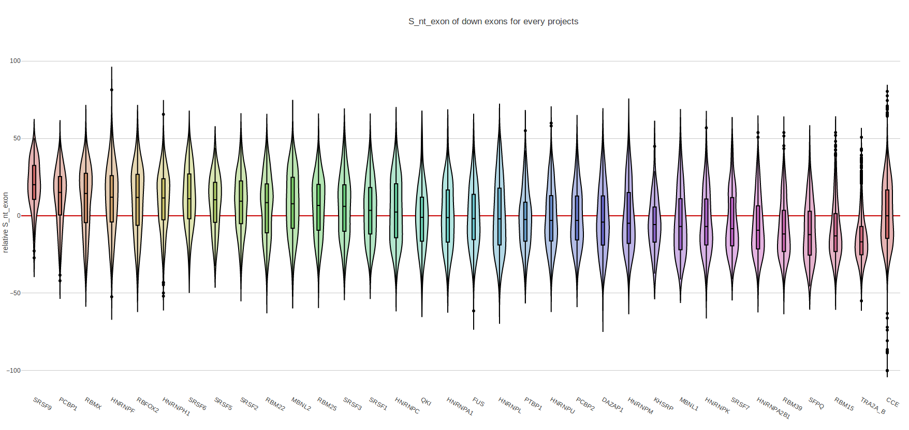

Supp Figure Creator's Documentation
==========================================

Description
-----------

The script ``figure_producer.py`` aims to create a lots of figures that shows, for each group of exons activated by a **splicing factor**, their distribution (represented with a violin plot) for many caracteristics described in **SED database.**.
It allow to create some supplementary figures of the article of *Lemaire et al* entitled :

:align:

  **Splicing factors and chromatin organization enhance exon recognition by alleviating constraints generated by gene nucleotide composition bias**

.. note::

  The rnaseq_project refers to every project analysed with FarRLine and stored in SED database. Each project (rnaseq-data) shows exons that are up- or down-regulated in a cell line where a splicing factor is depleted (compared to a control condition in the same cell line when the splicing factor is persent).

.. note::

  The exon regulated by a splicing factor correponds to  every exons regulated by this splicing factor in at least one cell line and always \
  showing the same regulation if shown in multiple cell line. If a exon is seen multiple times with the same \
  regulation in different cell line, it is only displayed once.

After launching the script some files should be created in the ``result/project_figures_union_new`` folder of the `Figure_SL` directory.
They sould be named like this: **<feature>_<regulation>_exons_figure.html**

**<regulation>** cant only take the following values :
  * **down** : if the figure show only **<prefix_name>** value for down-regulated exons in each rnaseq-project in splicing lore.
  * **up**: if the figure show only **<prefix_name>** value for up-regulated exons in each rnaseq-project in splicing lore.

**<feature>** takes a some of values that mean different things :

+-------------------------------------+----------------------------------------------------------------------------------------------------------------------------------------------------------------------+
|          **feature*                 |                                               **values of <regulation>  exons displayed in the figure**                                                              |
+-------------------------------------+----------------------------------------------------------------------------------------------------------------------------------------------------------------------+
|       force_acceptor                | The force of the splice acceptor site of the interest exon                                                                                                           |
+-------------------------------------+----------------------------------------------------------------------------------------------------------------------------------------------------------------------+
|       force_donor                   | The force of the splice donor site of the interest exon                                                                                                              |
+-------------------------------------+----------------------------------------------------------------------------------------------------------------------------------------------------------------------+
|          Xnt_exon                   | The frequency (%) of nucleotides X within the exon of interest . With X in A, C, G, T, S, W, R, Y, K, M                                                              |
+-------------------------------------+----------------------------------------------------------------------------------------------------------------------------------------------------------------------+
|  Xnt_upstream_intron                | The frequency (%) of nucleotides X within the upstream intron (0 is the first nucleotide of the exon)                                                                |
+-------------------------------------+----------------------------------------------------------------------------------------------------------------------------------------------------------------------+
|  Xnt_downstream_intron              | The frequency (%) of nucleotides X within the downstream intron (0 is the last nucleotide of the exon). With X in A, C, G, T, S, W, R, Y, K, M                       |
+-------------------------------------+----------------------------------------------------------------------------------------------------------------------------------------------------------------------+

For each **<feature>**, it's their relative median value compared to control exon that is displayed.
The following formula was used to compute the relative median of a **<feature>** :math:`D` in a set of :math:`n` exons :math:`S` compared to a set of :math:`m` control exons :math:`C`.

.. math::

  RFreq(D) = \frac{median(D_{S}) - median(D_{C})}{median(D_{C})} \times 100

Where, :math:`D_S` and :math:`D_C` are the vectors of :math:`D` values for the sets :math:`S` and :math:`C`.

Finally, each graphics look like this:

Prerequisites
-------------

This program was written in **Ubuntu 16.04** with the version **3.5 of python**. It should work on other unix system with a bash shell.

Steps to launch those scripts:

  * You may have to install python 3, if you do click `here <https://www.python.org/downloads/release/python-356/>`_
  * Install the required dependencies by running ``sudo pip3 install -r requierements.txt``. The file ``requierements.txt`` is the folder ``Figure_ESA`` and contains the name and the version of every required m$
  * You must copy (or create a shortcut to) the sed and fasterdb lite database into the data folder of ``Figure_SL``. (see how to create them in ``Database_creator``)

Executed code to produce the figures :

.. code:: bash

  python3 src/figure_producer.py union
